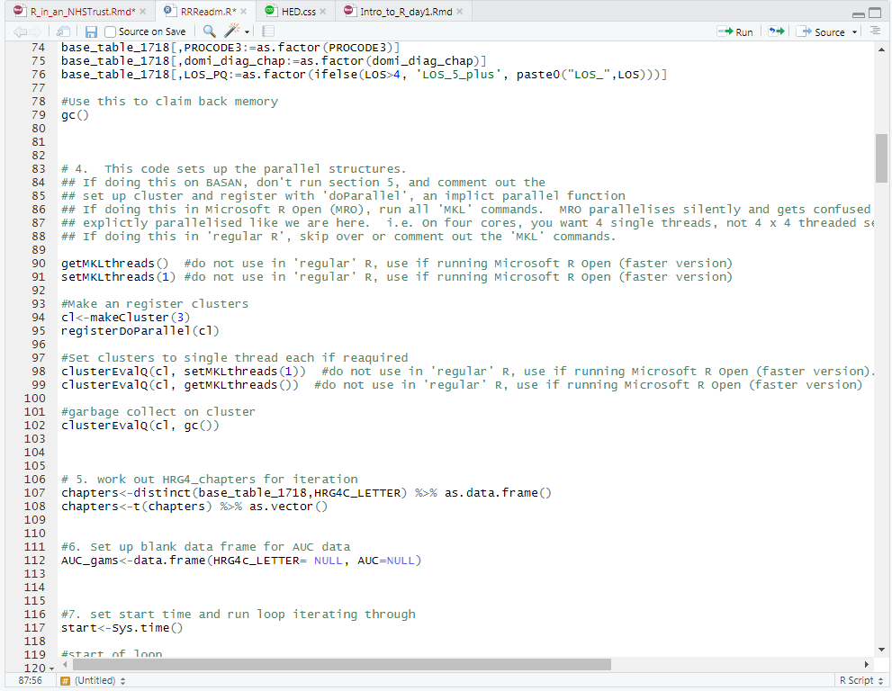
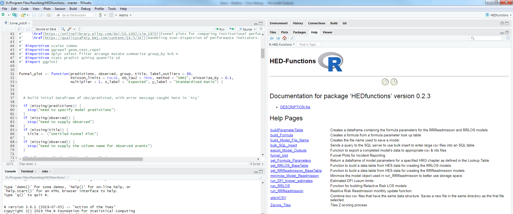
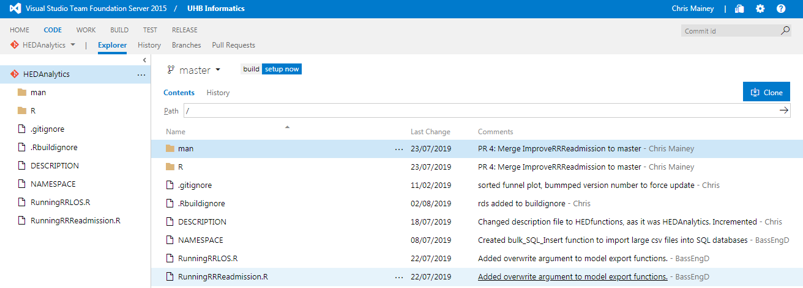

class: center

    

## Driving `R` adoption in an NHS information service: barriers and solutions

 

.pull-left[
__Chris Mainey__

Intelligence Analyst 
<b>University Hospitals Birmingham 
NHS Foundation Trust</b>

 
[chris.mainey@uhb.nhs.uk](mailto:chris.mainey@uhb.nhs.uk) 
`r icon::fa("twitter")` <a href="https://twitter.com/chrismainey?s=09" style="line-height:2;">@chrismainey</a>
]

.pull-right[

  

]

---

## University Hospitals Birmingham NHS FT 

- Second largest acute hospital trust in England
- Four hospital sites seeing approx. 440,000 in-patients per year

--

 

.pull-left[
- Large informatics team(s):
 - Core Information 
 - Analytics
 - SQL engineers/ Dashboard developers
 - Research 
 - Commercial
 ]
--

.pull-right[
 
___So we're all R-wielding data ninjas, right?___ 

]

---

## Healthcare Evaluation Data (HED)

<a href="www.hed.nhs.uk">www.hed.nhs.uk </a>

.pull-left[
- Online hospital benchmarking system
- Statistical models and analysis tools
- Activity, Mortality, Readmissions, Length-of-Stay, Marketshare etc.
- Used by ~60 NHS and other organisations
- Training and support
  
- __Using national NHS data__
]
.pull-right[
 

]

---

## Data analysis tools in the NHS

- Excel and Access were baseline 10-years ago

- Variable reliance on IT departments and external suppliers

- Huge differences in skills across, and within, organisations

- Increasing use of Qlik, PowerBI and Tableau

--

 
### UHB:

- Recruited SQL devs and slowly moved whole department
- Excel, SSRS and TIBCO Spotfire used for outputs

---

## Keenies...

.pull-left[

- R was used only for rare 'statistical' calculations 🦄

- A few keen researchers or medical students

- Simlar at other Trusts

- Also the case in our team...

- __But...__

]

--

.pull-right[

# One keen user...

]

---
## Allowed space to develop:

- PhD project, funded by UHB
- Developed statistical, visualisation and data wrangling skills

--

- Chose to use `R` from the outset, rather than SAS or Stata.
- Python training harder to find when I started

--

  
### Took a risk

- Moved some HED models to `R`, from SAS
- Supported other team members to use it
- This generated a demand for basic training

---
# Followed established patterns:

- Set up a local user group

--

- Trained senior team
 
--

- Encouraged new starters to use `R`

--

- External relationships:
 - Twitter has been key
 - NHS-R Community: https://nhsrcommunity.com/
 - External `R` user groups
 - Regional relationships: Other Trusts, PHE, City Council
 - Advice from Mango, RStudio and others

--

- ___Demonstrated ROI !!!___

---

# Barriers

- __Open Source fears:__ IT teams sometimes reluctant to install
--

- __Wrestling with default settings:__
 - Mapped user folders that aren't writable
 - Can't write to package library, or download temp files
--

- __Poor hardware__
 - Cheap desktops, low on disk space with minimal RAM
--
 
- __Lack of understanding of fundamentals:__
 - Networking/file locations
 - Suspicions around security
 - `R` coding, or its application to problems
 
---

# Solutions

- __Permissions:__  _Explicitly identify, and change, default settings_
--

 - Set a folders: `R_libs_user` or `.Renviron` file

--

- __Hardware:__ 
 - Make the case for more RAM! It doesn't cost much
 - Consider server approaches: VMs or 'Desktop' on a 'Server'
 - RStudio Server / RStudio Connect
--

- __Skill/Awareness:__
 - Protect time
 - Windows users often don't know file paths, SSH etc.
 - Central guidance on R/Python implementation
---

# How do we use it?

1. Regression, and related models (`mgcv`, `lme4`, `glmmTMB`, `glmnet`)
1. Machine Learning technique (`caret`, `randomForest`, `gbm`)
1. Optimisation problems (solving equations using `nloptr`)
1. Summary stats and Exploration
1. Data Visualisation (`ggplot2`, `FunnelPlotR`)
1. `RMarkdown` Reports and Presentations
1. API interaction (NHS ODS service, CQC registered organisations)

---

# Initial adoption:

.pull-left[
 

]
.pull-right[
- Collections of `R` scripts saved to directory
 - Required lead analyst to write
 - Required team skills to run and/or debug

- Constant debugging:
 - Data changing
 - Littered with comments, hard to decipher
 
]
---

# Creating a local package

Wrapped functions in to an `R` package structure

- Built binary package and saved to shared folders
--

- Used `roxygen2` to write support material

---

# Source control 

.pull-left[
- Moved to source control
 - Install git for windows 
 - Git learning curve
 - Happy Git with `R`! https://happygitwithr.com/ 
 ]
 
.pull-right[
 - Git repo on TFS
 - Figure out https connections
 - Stef Locke's `tfsr` https://github.com/lockedata/tfsR 
]

---
# NHS-R community

.pull-left[
- Promote `R` use in NHS
- Led by Prof. MA Mohammed
- Funded by grant from the Health Foundation
- Training provision
- Blog posts
- Share best practice
- Development of tools
- National Conference: 4th & 5th November
]

.pull-right[
   

]

---
  
## What's next?
  
- Continuing to develop analyst skills in `R`

--
  
- Spreading to different teams: control charts, Rmarkdown

--
  
- Contributing to, or building, Open Source tools with NHS-R community:
 - `FunnelPlotR`
 - `NHSRdatasets`

--
  
- Pushing further into ML techniques for prediction
 - Improving current models: Ensemble techniques etc.
 - Unsupervised techniques for cluster analysis.

---
class: middle

# Thanks for your time!

`r icon::fa("envelope")` <a href="mailto:chris.mainey@uhb.nhs.uk" style="line-height:2;"> chris.mainey@uhb.nhs.uk</a>
 
`r icon::ii("ios-browsers")` <a href="http://www.hed.nhs.uk" style="line-height:2;">http://www.hed.nhs.uk</a>
 
`r icon::fa("twitter")` <a href="https://twitter.com/chrismainey?s=09" style="line-height:2;">@chrismainey</a>
 
`r icon::fa("github")` <a href="https://github.com/chrismainey)" style="line-height:2;">chrismainey</a>
 
`r icon::ii("ios-browsers")` <a href="http://www.mainard.co.uk" style="line-height:2;">http://www.mainard.co.uk</a>
 
 
 `FunnelPlotR`  `r icon::fa("box")`  now available on CRAN!
